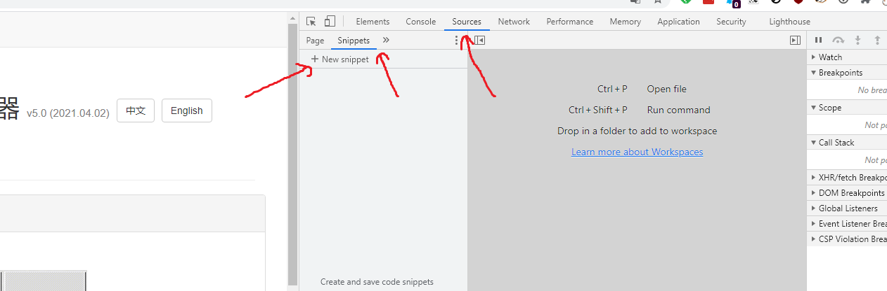
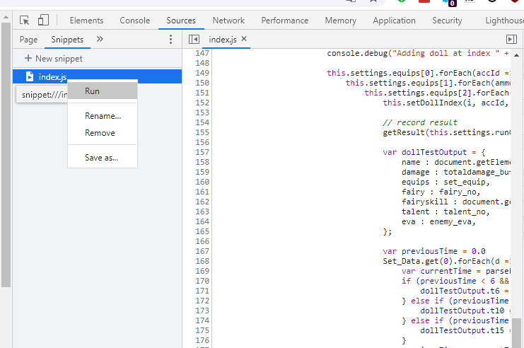
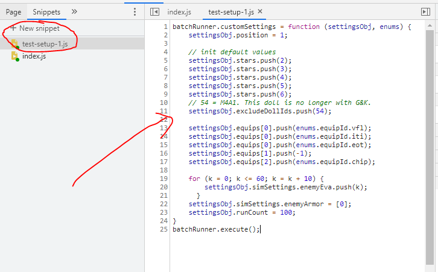

# hycdes-batch-sim

## Usage Instructions

1. Load the index.js into chrome developer toolbar -> source -> snipets

2. Save index.js into a snippet. Right click on this snippet and run it. This will load the engine.

3. Save test-setup-1.js into a snippet. This is the snippet where you can load/save different settings and execute them. Right click and select run will execute the sim.

You can set up different settings as you see fit and save them to different snippets.

The snippets are persisten.

